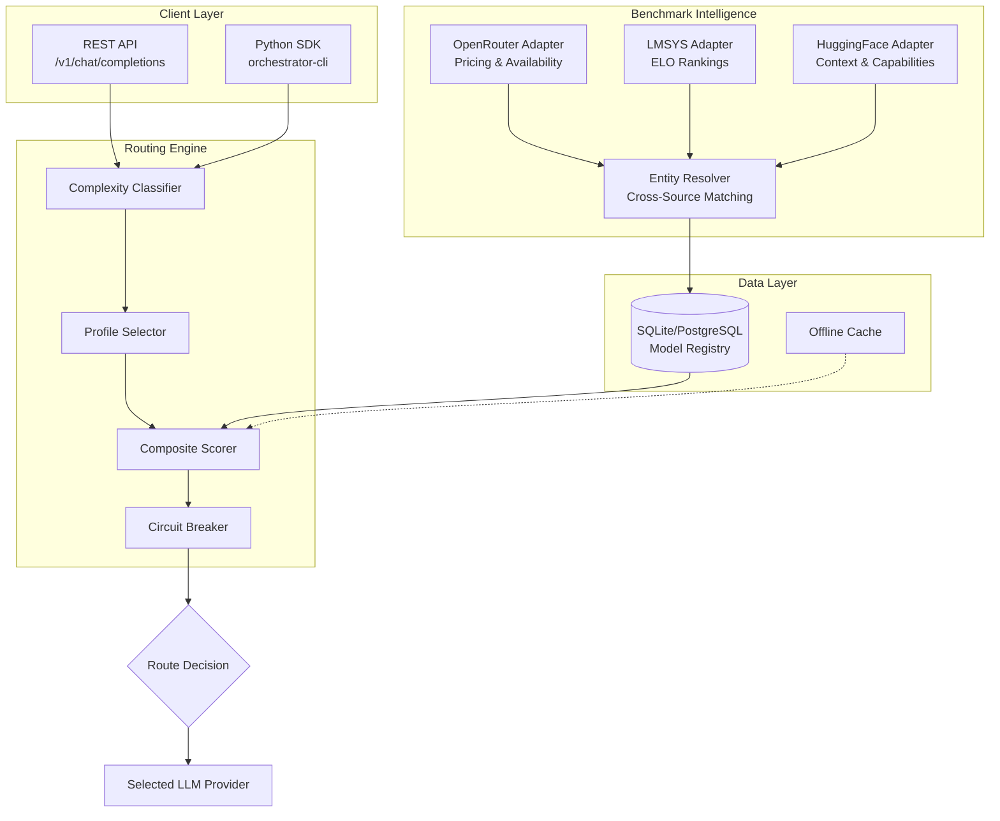

# Local AI Orchestrator

> **Intelligent model routing with quality, latency, and cost optimization.**  
> Abstract away LLM provider complexity. Route to the right model, every time.

[](https://github.com/jacattac314/local-ai-orchestrator/actions/workflows/ci.yml)
[](https://www.python.org/downloads/)
[](LICENSE)
[](https://github.com/psf/black)

---

## Executive Summary

Local AI Orchestrator is a **self-hosted routing layer** that sits between your application and multiple LLM providers. It ingests benchmarks from OpenRouter, LMSYS Arena, and HuggingFace, then dynamically routes each request to the optimal model based on quality, latency, cost, and context requirements.

**Key differentiator**: All routing decisions happen locally. Your prompts never touch third-party analytics services. You control costs. You maintain privacy.

### Why This Matters

| Alternative | Issue |
|-------------|-------|
| Hardcoded model selection | Doesn't adapt to benchmark changes |
| Cloud routing services | Privacy concerns, vendor lock-in, added latency |
| Manual model switching | Doesn't scale, error-prone |

---

## Problem Statement

Modern AI applications face three challenges:

1. **Model fragmentation** — Dozens of models across multiple providers, each with different strengths
2. **Cost unpredictability** — Token pricing varies 100x between models (GPT-4 vs. Mistral)
3. **Quality variance** — Benchmarks change weekly; yesterday's best model isn't today's

Most solutions require sending prompts to external routing services, creating **privacy and compliance risks**.

Local AI Orchestrator gives you **cloud-grade routing intelligence with local-first privacy**.

---

## System Architecture



### Component Breakdown

| Component | Responsibility |
|-----------|----------------|
| **Benchmark Aggregator** | Ingests model data from OpenRouter, LMSYS Arena, HuggingFace |
| **Entity Resolver** | Matches model identities across sources using fuzzy matching |
| **Routing Engine** | Scores models using configurable profiles, selects optimal route |
| **Circuit Breaker** | Tracks failures, temporarily disables failing models |
| **Offline Cache** | Enables operation during external API outages |

### Data Flow

1. **Request arrives** via REST API or Python SDK
2. **Complexity analysis** classifies prompt (simple/complex)
3. **Profile selection** applies weighting rules (quality/balanced/speed/budget)
4. **Composite scoring** ranks available models
5. **Circuit breaker check** filters out failing models
6. **Route decision** selects primary model + fallback chain
7. **Response proxied** back to client

---

## Key Capabilities

### 🎯 Intelligent Model Routing

- **5 built-in profiles**: `quality`, `balanced`, `speed`, `budget`, `long_context`
- **Complexity-aware selection**: Simple prompts → cheaper models; complex prompts → capable models
- **Constraint enforcement**: Minimum quality, maximum latency, budget caps

### 📊 Multi-Source Benchmark Intelligence

| Source | Data |
|--------|------|
| OpenRouter | Real-time pricing, availability, latency metrics |
| LMSYS Arena | ELO-based quality rankings from human evaluation |
| HuggingFace | Context windows, capabilities, model metadata |

### 💰 Cost Optimization

- Automatic fallback to cost-effective models for simple requests
- Token cost tracking per request
- Configurable budget thresholds

### 🔄 Production-Grade Resilience

- **Circuit breaker pattern**: 3 failures → 60s cooldown → half-open recovery
- **Automatic fallback**: Prepared fallback chain for each request
- **Offline mode**: Cached data enables operation during API outages
- **Retry logic**: Configurable retries with exponential backoff

---

## Routing Profiles

| Profile | Quality Weight | Latency Weight | Cost Weight | Best For |
|---------|----------------|----------------|-------------|----------|
| `quality` | 0.8 | 0.1 | 0.1 | Critical tasks, complex reasoning |
| `balanced` | 0.4 | 0.3 | 0.3 | General workloads |
| `speed` | 0.1 | 0.7 | 0.2 | Real-time applications |
| `budget` | 0.1 | 0.1 | 0.8 | High-volume, cost-sensitive |
| `long_context` | 0.3 | 0.2 | 0.2 | Documents, extended conversations |

---

## Quick Start

### Prerequisites

- Python 3.11+
- OpenRouter API key

### Installation

```bash
# Clone repository
git clone https://github.com/jacattac314/local-ai-orchestrator.git
cd local-ai-orchestrator

# Install dependencies
poetry install

# Configure environment
cp .env.example .env
# Edit .env with your OPENROUTER_API_KEY
```

### Run the Server

```bash
# Development
make run

# Production (Docker)
docker-compose up -d
```

### Make Your First Request

```bash
curl -X POST http://localhost:8000/v1/chat/completions \
  -H "Content-Type: application/json" \
  -d '{
    "messages": [{"role": "user", "content": "Hello!"}],
    "routing_profile": "balanced"
  }'
```

---

## API Reference

### OpenAI-Compatible Endpoints

| Endpoint | Method | Description |
|----------|--------|-------------|
| `/v1/chat/completions` | POST | Chat completion with routing |
| `/v1/models` | GET | List available models |
| `/health` | GET | Health check |
| `/metrics` | GET | Prometheus-compatible metrics |

### Orchestrator-Specific Endpoints

| Endpoint | Method | Description |
|----------|--------|-------------|
| `/v1/rankings` | GET | Current model rankings by profile |
| `/v1/status` | GET | System status and circuit breaker states |

---

## Configuration

### Environment Variables

| Variable | Required | Default | Description |
|----------|----------|---------|-------------|
| `OPENROUTER_API_KEY` | Yes | — | OpenRouter API key |
| `DATABASE_URL` | No | `sqlite:///data/orchestrator.db` | Database connection |
| `ORCHESTRATOR_API_KEY` | No | Disabled | API authentication |
| `ORCHESTRATOR_OFFLINE_MODE_ENABLED` | No | `true` | Enable offline cache |
| `LOG_LEVEL` | No | `INFO` | Logging verbosity |

### Sync Intervals

| Adapter | Default | Description |
|---------|---------|-------------|
| OpenRouter | 1 hour | Pricing and availability |
| LMSYS Arena | 24 hours | ELO rankings |
| HuggingFace | 24 hours | Model metadata |

---

## Tech Stack

| Layer | Technology |
|-------|------------|
| API | FastAPI, Uvicorn |
| Data | SQLAlchemy 2.0, SQLite/PostgreSQL |
| HTTP | httpx (async) |
| Scheduling | APScheduler |
| Validation | Pydantic 2.0 |
| CLI | Click, Rich |
| Testing | pytest (canary, integration, performance markers) |
| DevOps | Docker, Kubernetes, GitHub Actions |

---

## Development

```bash
# Run tests
make test                    # All tests
poetry run pytest -m canary  # Fast health checks
poetry run pytest -m integration  # End-to-end

# Code quality
make lint    # Ruff, Black, mypy
make format  # Auto-format

# Coverage
poetry run pytest --cov=src/orchestrator --cov-report=html
```

---

## Deployment

| Scale | Deployment | Database | Notes |
|-------|------------|----------|-------|
| Dev / < 10k req/day | Docker Compose | SQLite | Single-node, local testing |
| 10k–100k req/day | Docker on cloud | PostgreSQL | Add Redis for caching |
| > 100k req/day | Kubernetes | PostgreSQL | Horizontal scaling, HPA |

See [docs/DEPLOYMENT.md](docs/DEPLOYMENT.md) for detailed instructions.

---

## Roadmap

### v0.2.0 — Q1 2025
- [ ] Redis distributed caching
- [ ] Request quota management
- [ ] WebSocket streaming support

### v0.3.0 — Q2 2025
- [ ] A/B testing framework
- [ ] Custom adapter plugin system
- [ ] GraphQL endpoint

### v1.0.0 — Q3 2025
- [ ] Production SLA guarantees
- [ ] Multi-tenant support
- [ ] Enterprise observability integrations

---

## Design Principles

1. **Privacy-first** — Routing decisions happen locally; prompts never leave your infrastructure
2. **Cost-aware** — Always optimize for value, not just quality
3. **Resilient** — Fail gracefully with fallbacks and circuit breakers
4. **Observable** — Every routing decision is logged and traceable

---

## Who This Is For

- **Platform engineers** building AI-powered products
- **ML teams** managing multiple model deployments
- **Security-conscious orgs** requiring local data processing
- **Startups** optimizing AI costs at scale

---

## Project Structure

```
local-ai-orchestrator/
├── src/orchestrator/          # Core application
│   ├── api/                   # FastAPI routes
│   ├── routing/               # Scoring, profiles, router
│   ├── adapters/              # OpenRouter, LMSYS, HuggingFace
│   ├── resolution/            # Entity matching
│   ├── db/                    # SQLAlchemy models, manager
│   └── scheduler/             # APScheduler jobs
├── orchestrator_client/       # Python SDK
├── frontend/                  # Dashboard UI
├── tests/                     # Test suite
├── docs/                      # Architecture, deployment docs
└── docker-compose.yml         # Container orchestration
```

---

## Contributing

We welcome contributions! Please see [CONTRIBUTING.md](CONTRIBUTING.md) for guidelines.

---

## License

MIT License — see [LICENSE](LICENSE) for details.

---

## Acknowledgments

- [OpenRouter](https://openrouter.ai/) for model aggregation
- [LMSYS](https://chat.lmsys.org/) for benchmark data
- [HuggingFace](https://huggingface.co/) for model metadata

---

<details>
<summary><strong>📋 For Hiring Managers</strong></summary>

### What This Project Demonstrates

| Skill | Evidence |
|-------|----------|
| **System Design** | Multi-source aggregation, circuit breaker pattern, fallback chains |
| **API Design** | OpenAI-compatible REST API, consistent error handling |
| **Data Engineering** | Entity resolution across disparate sources, scheduled sync |
| **Production Readiness** | Docker, Kubernetes manifests, health checks, observability hooks |
| **Testing Strategy** | Canary tests for CI, integration tests, performance markers |
| **Code Quality** | Type hints, dataclasses, clean separation of concerns |

### Technical Decisions Worth Noting

1. **Why local routing?** Privacy-first design prevents prompt leakage to third-party services
2. **Why multi-source benchmarks?** No single source provides complete quality + cost + latency data
3. **Why circuit breakers?** Prevents cascade failures when providers are degraded
4. **Why SQLite default?** Zero-config development; PostgreSQL for production

### Questions I Can Discuss

- Tradeoffs in model scoring algorithms
- Scaling patterns for high-throughput routing
- Observability strategies for ML systems
- Cost optimization in LLM-heavy applications

</details>
