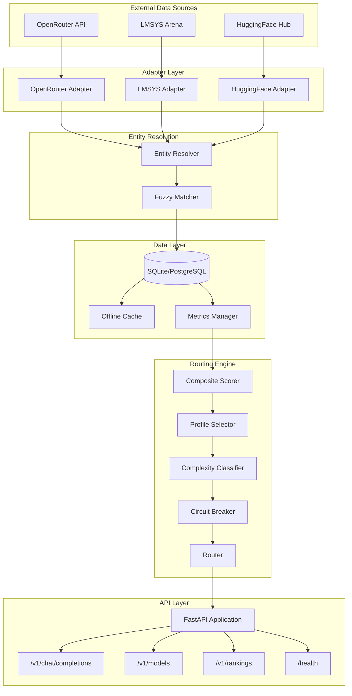
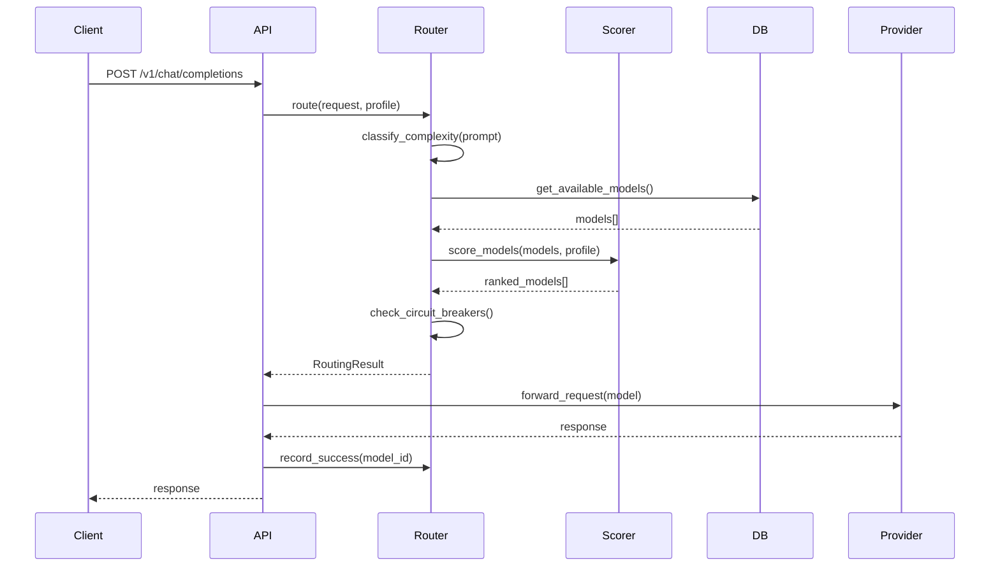
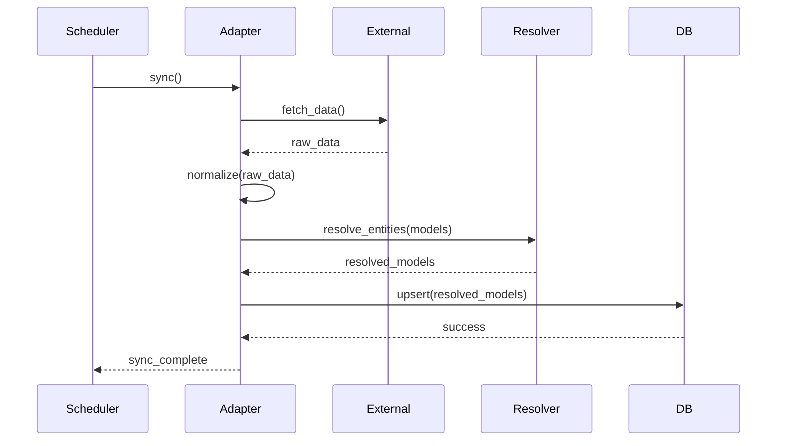

# Architecture

## Overview

Local AI Orchestrator is designed as a modular, layered system that ingests benchmark data from multiple sources, normalizes and aggregates this data, and provides intelligent routing decisions for AI model selection.

## System Diagram



## Core Components

### API Layer

The API layer is built on FastAPI and provides an OpenAI-compatible REST interface.

| Endpoint | Method | Description |
|----------|--------|-------------|
| `/v1/chat/completions` | POST | Primary routing endpoint |
| `/v1/models` | GET | List available models with scores |
| `/v1/rankings` | GET | Model rankings by routing profile |
| `/health` | GET | Health check endpoint |
| `/metrics` | GET | Prometheus-compatible metrics |

**Key Files:**
- `src/orchestrator/api/routes.py`: Route definitions
- `src/orchestrator/api/schemas.py`: Pydantic request/response models

### Routing Engine

The routing engine is the core intelligence layer. It consists of:

#### Complexity Classifier

Analyzes incoming prompts to determine complexity level:
- **Simple**: Basic queries, short responses expected
- **Moderate**: Multi-step reasoning, some context
- **Complex**: Deep analysis, long context, specialized knowledge

**File:** `src/orchestrator/routing/complexity.py`

#### Profile Selector

Applies routing profiles that define weighting for different optimization goals:

| Profile | Quality | Latency | Cost | Use Case |
|---------|---------|---------|------|----------|
| `quality` | 0.8 | 0.1 | 0.1 | Critical tasks |
| `balanced` | 0.4 | 0.3 | 0.3 | General workloads |
| `speed` | 0.1 | 0.7 | 0.2 | Real-time apps |
| `budget` | 0.1 | 0.1 | 0.8 | High volume |
| `long_context` | 0.3 | 0.2 | 0.2 | Documents |

**File:** `src/orchestrator/routing/profiles.py`

#### Composite Scorer

Normalizes metrics from different sources and calculates weighted scores:

1. Normalize quality metrics (ELO → 0.0-1.0)
2. Normalize latency metrics (p90 → 0.0-1.0, inverted)
3. Normalize cost metrics ($/million tokens → 0.0-1.0, inverted)
4. Apply profile weights
5. Calculate composite score

**File:** `src/orchestrator/routing/scorer.py`

#### Circuit Breaker

Implements the circuit breaker pattern for resilience:

| State | Behavior |
|-------|----------|
| CLOSED | Normal operation, requests pass through |
| OPEN | Model disabled, requests rejected |
| HALF_OPEN | Testing recovery, single request allowed |

**Configuration:**
- Failure threshold: 3 failures
- Recovery timeout: 60 seconds

**File:** `src/orchestrator/routing/router.py`

### Adapter Layer

Adapters fetch data from external sources and normalize it for storage.

#### OpenRouter Adapter

- **Data**: Model availability, pricing, latency metrics
- **Sync interval**: 1 hour
- **API**: `https://openrouter.ai/api/v1/models`

**File:** `src/orchestrator/adapters/openrouter.py`

#### LMSYS Adapter

- **Data**: ELO ratings from Arena battles
- **Sync interval**: 24 hours
- **Source**: Public LMSYS Arena data

**File:** `src/orchestrator/adapters/lmsys.py`

#### HuggingFace Adapter

- **Data**: Model metadata, context windows, capabilities
- **Sync interval**: 24 hours
- **API**: HuggingFace Hub API

**File:** `src/orchestrator/adapters/huggingface.py`

### Entity Resolution

The entity resolver matches models across different sources that may use different naming conventions.

**Example:**
- OpenRouter: `openai/gpt-4-turbo`
- LMSYS: `gpt-4-turbo-2024-04-09`
- HuggingFace: `gpt-4-turbo`

**Matching strategy:**
1. Exact match on canonical names
2. Fuzzy matching with configurable threshold
3. Manual alias mappings for edge cases

**File:** `src/orchestrator/resolution/entity_resolver.py`

### Data Layer

#### Database

SQLAlchemy ORM with support for:
- **SQLite**: Default for development
- **PostgreSQL**: Recommended for production

**Tables:**
- `models`: Model registry with metadata
- `metrics`: Historical performance data
- `rankings`: Pre-computed rankings by profile
- `routing_decisions`: Audit log of routing decisions

**File:** `src/orchestrator/db/models.py`

#### Offline Cache

JSON-based cache that enables operation when external APIs are unavailable.

- Automatically populated during normal operation
- Configurable TTL
- Enabled via `ORCHESTRATOR_OFFLINE_MODE_ENABLED=true`

**File:** `src/orchestrator/db/cache.py`

### Scheduler

APScheduler powers background tasks:

| Task | Interval | Description |
|------|----------|-------------|
| `sync_openrouter` | 1 hour | Fetch OpenRouter data |
| `sync_lmsys` | 24 hours | Fetch LMSYS benchmarks |
| `sync_huggingface` | 24 hours | Fetch HuggingFace metadata |
| `prune_metrics` | Daily | Clean old metrics data |
| `update_rankings` | After sync | Recompute model rankings |

**File:** `src/orchestrator/scheduler/scheduler.py`

## Data Flow

### Request Lifecycle



### Benchmark Sync Lifecycle



## Configuration

### Environment Variables

| Variable | Default | Description |
|----------|---------|-------------|
| `OPENROUTER_API_KEY` | Required | OpenRouter API key |
| `DATABASE_URL` | `sqlite:///data/orchestrator.db` | Database connection |
| `ORCHESTRATOR_API_KEY` | None | Optional API authentication |
| `ORCHESTRATOR_OFFLINE_MODE_ENABLED` | `true` | Enable offline cache |
| `ORCHESTRATOR_METRIC_RETENTION_DAYS` | `30` | Metrics retention period |
| `LOG_LEVEL` | `INFO` | Logging verbosity |

### Sync Intervals

| Adapter | Variable | Default |
|---------|----------|---------|
| OpenRouter | `OPENROUTER_SYNC_INTERVAL` | 3600 (1 hour) |
| LMSYS | `LMSYS_SYNC_INTERVAL` | 86400 (24 hours) |
| HuggingFace | `HUGGINGFACE_SYNC_INTERVAL` | 86400 (24 hours) |

## Performance Considerations

### Latency Budget

Target: < 50ms routing overhead

| Component | Target | Notes |
|-----------|--------|-------|
| Complexity analysis | < 5ms | Lightweight heuristics |
| Profile lookup | < 1ms | In-memory |
| Model scoring | < 20ms | Depends on model count |
| Circuit breaker check | < 1ms | In-memory state |
| Database query | < 20ms | Indexed queries |

### Caching Strategy

- **Model data**: Cached in-memory, refreshed on sync
- **Rankings**: Pre-computed per profile, stored in DB
- **Circuit breaker state**: In-memory, per-instance

### Database Optimization

- Indexed columns: `model_id`, `provider`, `timestamp`
- Partitioned metrics table by date (PostgreSQL)
- Connection pooling via SQLAlchemy

## Scalability

### Horizontal Scaling

For high-throughput deployments:

1. **Stateless API**: Multiple instances behind load balancer
2. **Shared database**: PostgreSQL with read replicas
3. **Distributed caching**: Redis for shared state
4. **Sticky sessions**: Not required

### Kubernetes Deployment

```yaml
# Recommended resource limits
resources:
  requests:
    memory: "256Mi"
    cpu: "250m"
  limits:
    memory: "512Mi"
    cpu: "500m"
```

See `docs/DEPLOYMENT.md` for detailed Kubernetes manifests.

## Security

### API Authentication

When `ORCHESTRATOR_API_KEY` is set:
- All endpoints require `Authorization: Bearer <key>`
- Health check exempt

### SSRF Protection

URL validation prevents SSRF attacks:
- Configurable allowlist via `ORCHESTRATOR_ALLOWED_DOMAINS`
- Private IP ranges blocked by default

### Input Validation

- Pydantic models for all request/response schemas
- Strict type checking
- Maximum request size limits

## Future Enhancements

### Short-term (v0.2)
- Redis distributed caching
- Request quota management
- WebSocket streaming

### Medium-term (v0.3)
- A/B testing framework
- Custom adapter plugins
- GraphQL endpoint

### Long-term (v1.0)
- Multi-tenant support
- Enterprise observability (OpenTelemetry)
- Production SLA guarantees

## Dependencies

### Runtime

| Package | Version | Purpose |
|---------|---------|---------|
| fastapi | ^0.109 | Web framework |
| uvicorn | ^0.27 | ASGI server |
| sqlalchemy | ^2.0 | ORM |
| httpx | ^0.27 | HTTP client |
| apscheduler | ^3.10 | Task scheduling |
| pydantic | ^2.0 | Validation |

### Development

| Package | Version | Purpose |
|---------|---------|---------|
| pytest | ^8.0 | Testing |
| ruff | ^0.2 | Linting |
| black | ^24.0 | Formatting |
| mypy | ^1.8 | Type checking |

## Related Documentation

- [README.md](../README.md): Getting started
- [DEPLOYMENT.md](DEPLOYMENT.md): Production deployment
- [CONTRIBUTING.md](../CONTRIBUTING.md): Contribution guidelines
- [CHANGELOG.md](../CHANGELOG.md): Version history
